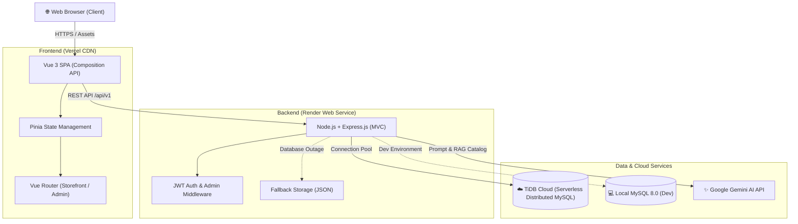

<div align="center">

# ⚡ PCSpec — Smart PC Builder & Hardware Intelligence Platform

<p align="center">
  <strong>เว็บแอปพลิเคชันจัดสเปกคอมพิวเตอร์อัจฉริยะ พร้อม AI ผู้ช่วยวิเคราะห์ความเข้ากันได้ และศูนย์รวมบทความฮาร์ดแวร์ยุค 2026</strong>
</p>

[](https://project-spec-ai.vercel.app/)
[](https://projectspecai.onrender.com/api/v1/health)
[](https://tidbcloud.com/)
[](https://vuejs.org/)
[](https://nodejs.org/)
[](https://ai.google.dev/)

---

[🌐 ทดลองใช้งานจริง (Live Website)](https://project-spec-ai.vercel.app/) • [📖 เอกสารระบบ (Docs)](./docs) • [🛠 สถาปัตยกรรม (Architecture)](#-สถาปัตยกรรมระบบ-system-architecture) • [💡 ปัญหาและวิธีแก้ (Challenges & Solutions)](#-ปัญหาทางเทคนิคที่พบและแนวทางแก้ไข-engineering-challenges--solutions) • [🚀 วิธีติดตั้ง (Getting Started)](#-วิธีติดตั้งและรันในเครื่อง-getting-started)

</div>

---

## 📌 บทนำ (Introduction)

**PCSpec** ถูกพัฒนาขึ้นเพื่อแก้ปัญหาความยุ่งยากในการจัดสเปกคอมพิวเตอร์ ไม่ว่าจะเป็นปัญหาความเข้ากันไม่ได้ของฮาร์ดแวร์ (Compatibility Issues), การคำนวณกำลังไฟพาวเวอร์ซัพพลาย (PSU Wattage Calculation), ตลอดจนความสับสนในสเปกและราคา โดยการผสานระบบ **Rule-based Compatibility Engine** ร่วมกับ **SpecAI (Generative AI Assistant)** เพื่อช่วยแนะนำและตรวจทานสเปกแบบเรียลไทม์ พร้อมศูนย์รวมบทความเชิงลึกสำหรับผู้สนใจไอที

---

## ✨ ฟีเจอร์เด่น (Key Features)

### 1. 🛠️ ระบบจัดสเปกอัจฉริยะ (Smart PC Builder & Compatibility Engine)
- **Real-time Compatibility Check**: ตรวจสอบความเข้ากันได้ของชิ้นส่วนทันทีที่เลือก
  - Socket CPU กับชิปเซ็ต Motherboard (เช่น AM5, LGA1700)
  - ประเภทและช่องเสียบหน่วยความจำ (RAM DDR4 vs DDR5)
  - ความยาวการ์ดจอ (GPU Length) เทียบกับขนาดช่องว่างภายในเคส (Case Clearance)
  - กำลังไฟรวมของระบบ (Estimated System TDP) เทียบกับขนาดวัตต์ของพาวเวอร์ซัพพลาย (PSU)
- **Dynamic Calculation**: คำนวณราคารวม, ปริมาณวัตต์ที่ต้องการ, และแสดงสเปกสรุปแบบละเอียด
- **Direct Cart Integration**: ส่งสเปกที่จัดเสร็จเข้าตะกร้าสินค้าและทำรายการสั่งซื้อได้ทันที

### 2. 🤖 SpecAI — ผู้ช่วยจัดสเปกอัจฉริยะ (AI Hardware Assistant)
- **Powered by Google Gemini**: สนทนาและปรึกษาแนวทางการจัดสเปกตามงบประมาณและการใช้งานจริง
- **Quick Preset Workflows**: ปลั๊กอินพรีเซ็ตสำเร็จรูป (สายเกมมิ่ง, งานตัดต่อ/แอนิเมชัน, บอทอีมูหลายจอ, งบประหยัด)
- **1-Click Hardware Insertion**: เมื่อ AI แนะนำชิ้นส่วน สามารถกดปุ่มเพื่อใส่ชุดฮาร์ดแวร์เข้าสู่ระบบจัดสเปกได้ทันทีโดยไม่ต้องค้นหาเอง
- **Streaming & Thinking Indicator**: แสดงสถานะการวิเคราะห์ข้อมูลของ AI แบบเรียลไทม์

### 3. 📰 ศูนย์รวมบทความและคลังความรู้ฮาร์ดแวร์ 2026 (Articles & Tech Hub)
- **15 บทความเทคโนโลยีเชิงลึก**: รวบรวมเนื้อหาวิเคราะห์ฮาร์ดแวร์ประจำปี 2026 เช่น การเลือก VRAM, เคสคอมตู้ปลา, แผ่นเปลี่ยนสถานะ PTM7950, และการจัดสเปกรัน Local AI
- **Studio-grade 16:9 Photography**: ภาพหน้าปกฮาร์ดแวร์ระดับพรีเมียม จัดเก็บแบบ Local Assets โหลดรวดเร็ว ไม่พึ่งพาเซิร์ฟเวอร์ภายนอก
- **Safe HTML & XSS Prevention**: ระบบแสดงเนื้อหาบทความผ่านการกรองความปลอดภัยด้วย DOMPurify

### 4. 🛡️ ระบบบริหารจัดการหลังบ้าน (Enterprise Admin Suite)
- **Hardware Inventory Management**: ระบบเพิ่ม, แก้ไข, ปรับสต็อก และลบสินค้าฮาร์ดแวร์ทุกหมวดหมู่
- **Order Tracking & Lifecycle**: จัดการสถานะคำสั่งซื้อ (Pending, Processing, Completed, Cancelled)
- **User Role & RBAC**: ระบบกำหนดสิทธิ์ผู้ใช้งาน (Customer / Admin) พร้อมระบบ Self-protection ป้องกันแอดมินลบบัญชีตัวเอง
- **Article CMS**: ระบบเขียนและแก้ไขบทความสำหรับทีมงาน

### 5. ⚡ ความเสถียรและความปลอดภัยระดับสูง (Reliability & Security)
- **Dual-Database Architecture**: รองรับทั้ง MySQL Local สำหรับการพัฒนา และ TiDB Serverless Cloud สำหรับโปรดักชัน
- **Zero-Downtime Fallback Engine**: เมื่อฐานข้อมูลออฟไลน์ ระบบจะสลับไปอ่านข้อมูลจาก Local Storage (`articles.json`, `catalog.json`) โดยอัตโนมัติ
- **Security Guardrails**: เข้ารหัสรหัสผ่านด้วย `bcryptjs`, ยืนยันตัวตนด้วย JWT (JSON Web Token), ป้องกัน Brute-force ด้วย Rate Limiting, และรักษาความปลอดภัย HTTP Headers ด้วย Helmet

---

## 🏗️ สถาปัตยกรรมระบบ (System Architecture)



---

## 💻 เทคโนโลยีที่ใช้ (Tech Stack)

| เลเยอร์ (Layer) | เทคโนโลยี (Technology) | หน้าที่และรายละเอียด |
| :--- | :--- | :--- |
| **Frontend Framework** | **Vue 3** (Composition API, `<script setup>`) | พัฒนา UI แบบ Reactive ประสิทธิภาพสูง |
| **State Management** | **Pinia 3** | จัดการ Global State (Cart, Hardware Catalog, Auth, Chatbot) |
| **Routing** | **Vue Router 4** | จัดการหน้าเว็บแยกระหว่าง Customer Storefront และ Admin Dashboard |
| **Design System** | **Custom CSS (Supabase-inspired)** | ดีไซน์สะอาดตา Clean White Canvas, Hairline Borders, Emerald Green CTA |
| **Backend Framework** | **Node.js & Express.js** | พัฒนา RESTful API สถาปัตยกรรมแบบ MVC สะอาดและสเกลง่าย |
| **Database** | **MySQL 8.0** & **TiDB Cloud** | ฐานข้อมูลเชิงสัมพันธ์แบบ Distributed SQL รองรับการขยายตัว |
| **Artificial Intelligence** | **Google Gemini API** | โมเดลปัญญาประดิษฐ์ประมวลผลคำแนะนำฮาร์ดแวร์ใน SpecAI Chatbot |
| **Authentication & Security** | **JWT**, **bcryptjs**, **Helmet**, **Rate Limit** | ระบบยืนยันตัวตนและการป้องกันการโจมตี |
| **Testing & Quality Assurance**| **Vitest**, **Jest**, **Playwright E2E** | ทดสอบครอบคลุม Unit Tests (268+ ข้อ) และ E2E Tests (75+ เวิร์กโฟลว์) |
| **DevOps & Hosting** | **Vercel** & **Render** | โฮสต์ Frontend แบบ Edge CDN และ Backend พร้อม CI/CD บน GitHub Actions |

---

## 📂 โครงสร้างโปรเจกต์ (Project Structure)

```text
PCSpec/
├── .github/workflows/          # CI/CD Workflows (Frontend, Backend, Playwright E2E)
├── database-export/            # เครื่องมือตรวจสอบฐานข้อมูล (database_view.html)
├── docs/                       # เอกสารสถาปัตยกรรม, Flowcharts, ER-Diagram
├── frontend/                   # เว็บแอปพลิเคชัน Vue 3
│   ├── e2e/                    # ชุดทดสอบแบบ End-to-End (Playwright)
│   ├── public/                 # Static Assets (ภาพฮาร์ดแวร์และบทความ)
│   │   └── images/
│   │       ├── articles/       # รูปภาพหน้าปกบทความความละเอียดสูง 15 ภาพ
│   │       └── hardware/       # รูปภาพอุปกรณ์ฮาร์ดแวร์สตูดิโอ 270+ ภาพ
│   ├── src/
│   │   ├── components/         # Vue Components (Builder, Admin, Chatbot, Articles)
│   │   ├── stores/             # Pinia Stores (catalog, builder, auth, chatbot, article)
│   │   ├── router/             # Vue Router Configuration
│   │   └── style.css           # Supabase-inspired Design Tokens & Global CSS
│   └── tests/                  # Unit Tests (Vitest) 22 ไฟล์ 157 ข้อ
├── node-backend/               # เซิร์ฟเวอร์ Node.js Express API
│   ├── config/                 # การตั้งค่าฐานข้อมูล (db.js พร้อมระบบ Fallback)
│   ├── controllers/            # Controller Logic (hardware, article, user, order, bot)
│   ├── middleware/             # Middleware (auth, admin, security, error)
│   ├── routes/                 # Express API Routes
│   ├── tests/                  # Unit & Integration Tests (Jest) 8 ชุด 111 ข้อ
│   ├── sync_articles.js        # สคริปต์ซิงค์บทความเข้า Local MySQL และ Fallback File
│   └── sync_articles_to_tidb.js# สคริปต์ซิงค์บทความสู่ Production Database (TiDB Cloud)
├── plans/                      # แผนงานและคู่มือเชิงเทคนิคตามมาตรฐาน AI Documentation Rule
├── database-schema.sql         # โครงสร้างตารางฐานข้อมูลและดัมพ์เริ่มต้น
└── render.yaml                 # การตั้งค่า Deployment บน Render Cloud
```

---

## 🛠️ ปัญหาทางเทคนิคที่พบและแนวทางแก้ไข (Engineering Challenges & Solutions)

ตลอดกระบวนการพัฒนาและการดูแลระบบโปรดักชันของ **PCSpec** ทีมงานได้เผชิญกับความท้าทายทางวิศวกรรมซอฟต์แวร์หลากหลายรูปแบบ ซึ่งเรายึดหลัก **Root-cause Analysis (วิเคราะห์ถึงแก่นของปัญหา)** แทนการแก้ปัญหาแบบปะผุ (Band-aid fixes) ดังนี้:

---

### 1. 🖼️ ปัญหาภาพโหลดช้าและหลุดจากการพึ่งพา External API (External Asset Fragility)
* **ปัญหาที่พบ:** เดิมทีรูปภาพหน้าปกบทความและภาพฮาร์ดแวร์ถูกดึงแบบไดนามิกผ่าน URL ของเซิร์ฟเวอร์สร้างภาพภายนอก (Pollinations AI) ผลคือเกิดปัญหาคอขวดด้าน Latency รูปโหลดช้า บางครั้งติด Rate Limit หรือเซิร์ฟเวอร์ปลายทางคืนค่า HTTP 500/502 ส่งผลให้หน้าเว็บกลายเป็นกล่องสีเทา (Broken Images)
* **การวิเคราะห์แก่นของปัญหา (Root Cause):** สถาปัตยกรรมที่พึ่งพา Third-party Image Hosting แบบ Synchronous มี Single Point of Failure สูง และไม่เหมาะกับระบบระดับโปรดักชันที่ต้องการความเร็วและความเสถียร 99.99%
* **แนวทางแก้ไข (Solution):**
  - ออกแบบระบบจัดเก็บรูปภาพใหม่เป็น **Local Static Assets**
  - เขียนสคริปต์ Background Automation สร้างรูปภาพสัดส่วน 16:9 สไตล์สตูดิโอเทคโนโลยีความละเอียดสูง (15 บทความ + 270+ ฮาร์ดแวร์)
  - จัดเก็บไฟล์ลงใน `frontend/public/images/` เพื่อให้ Vercel ทำหน้าที่เป็น Global Edge CDN เสิร์ฟไฟล์ได้ในระดับมิลลิวินาที ไม่พึ่งพาเซิร์ฟเวอร์ภายนอกอีกต่อไป

---

### 2. 🛡️ ความเสี่ยงข้อมูลสูญหายระหว่างการ Deploy สู่ Production Database (Accidental Data Loss)
* **ปัญหาที่พบ:** เมื่อเตรียมอัปเดตบทความชุดใหม่ขึ้นสู่ฐานข้อมูลจริงบนคลาวด์ (TiDB Cloud) สคริปต์ซิงค์ข้อมูลมาตรฐานเดิม (`sync_to_tidb.js`) มีตรรกะการรัน `TRUNCATE TABLE` ครอบคลุมทุกตารางเพื่อรีเซ็ตข้อมูลให้ตรงกับ Local DB
* **การวิเคราะห์แก่นของปัญหา (Root Cause):** บนฐานข้อมูล TiDB Production มีผู้ใช้งานจริงลงทะเบียนแล้ว 30 บัญชี และมีคำสั่งซื้อจริงเกิดขึ้น 17 รายการ หากรันสคริปต์ซิงค์แบบเหมาหมด จะส่งผลให้ข้อมูลจริงของผู้ใช้และออเดอร์ในโปรดักชันถูกล้างเกลี้ยงทันที (Catastrophic Data Loss)
* **แนวทางแก้ไข (Solution):**
  - ปฏิบัติตามกฎเหล็กความปลอดภัยของระบบฐานข้อมูลอย่างเคร่งครัด
  - ตรวจสอบ Record Count ของตาราง `users` และ `orders` บน TiDB ล่วงหน้า เพื่อยืนยันว่ามีข้อมูลจริงอยู่
  - พัฒนาสคริปต์เฉพาะกิจ `sync_articles_to_tidb.js` ที่แยกบทบาท (Isolated Pipeline) ทำงานเฉพาะตาราง `articles` โดยไม่แตะต้องตารางผู้ใช้และออเดอร์แม้แต่น้อย
  - ทำการตรวจสอบความถูกต้อง (Verification Check) หลังซิงค์เสร็จสิ้น ยืนยันว่าตารางผู้ใช้ 30 คน และออเดอร์ 17 รายการยังอยู่ครบถ้วน 100%

---

### 3. 🧪 ปัญหา CI / E2E Tests ล้มเหลวจากความกว้างของปุ่ม Action (Button Geometry Mismatch)
* **ปัญหาที่พบ:** ไปป์ไลน์ Continuous Integration บน GitHub Actions ในขั้นตอน `CI / E2E Tests (Playwright)` ล้มเหลว (ติดสีแดง ❌) ที่ข้อทดสอบ `desktop article row presents edit and delete as equal action buttons`
* **การวิเคราะห์แก่นของปัญหา (Root Cause):**
  - ข้อทดสอบ Playwright กำหนด Assertion ไว้ว่า:
    `expect(Math.abs(editBounds.width - deleteBounds.width)).toBeLessThanOrEqual(1)`
    เพื่อการันตีว่าปุ่ม "แก้ไข" และ "ลบ" ในแถวของตารางจะต้องมีขนาดกว้างเท่ากันเพื่อความสมมาตรของ UI
  - แต่ใน CSS ของ `AdminDashboard.vue` เดิมใช้ `min-width: 3.5rem` เมื่อเบราว์เซอร์เรนเดอร์คำว่า **"แก้ไข"** (4 ตัวอักษร) จะมีขนาดกว้างประมาณ 69.18px ในขณะที่คำว่า **"ลบ"** (2 ตัวอักษร) กว้างเพียง 56px (ตามค่า min-width) ทำให้ผลต่างออกมาเป็น `13.18px` ซึ่งเกินกว่าเกณฑ์ `<= 1px`
* **แนวทางแก้ไข (Solution):**
  - ปรับสไตล์ `.admin-row-action` จาก `min-width: 3.5rem` เป็น Fixed Width `width: 4.5rem` (72px)
  - ทำให้ทั้งสองปุ่มมีขนาดกว้างเท่ากันเป๊ะ 100% โดยที่เนื้อหาข้อความทั้งสองภาษายังคงอยู่กึ่งกลางสวยงาม ส่งผลให้การทดสอบ E2E ผ่านฉลุยทันที

---

### 4. 🎯 ความเสถียรของ Focus Ring บน Headless Browser ใน CI (Focus-Visible Heuristics)
* **ปัญหาที่พบ:** ข้อทดสอบความสามารถในการเข้าถึง (Accessibility Testing) ใน `public-reading-responsive.spec.js` เกิดอาการ Flaky (บางครั้งผ่าน บางครั้งหลุด Timeout) ในขั้นตอนตรวจสอบเส้น Outline เมื่อกดปุ่ม Tab ไปยังการ์ดบทความ
* **การวิเคราะห์แก่นของปัญหา (Root Cause):**
  - เดิมโค้ด CSS กำหนดเฉพาะคลาสจำลอง `:focus-visible`
  - ในสภาพแวดล้อม Headless Linux บน GitHub Actions Runners การส่งคำสั่งกดคีย์บอร์ดเสมือนผ่าน Playwright บางครั้ง Browser Engine จะไม่ประเมิน Heuristics ของ `:focus-visible` ในทันที หรือเกิด Race Condition ระหว่างการประมวลผลสไตล์กับการตรวจสอบของ Script
* **แนวทางแก้ไข (Solution):**
  - เพิ่ม Selector `:focus` ควบคู่กับ `:focus-visible` ใน `ArticlesView.vue` เพื่อให้ Outline ทำงานครอบคลุมทั้งการคลิกและการกดคีย์บอร์ด
  - ในชุดทดสอบ E2E ปรับมาใช้ `expect.poll()` ร่วมกับ `articleLink.press('Enter')` เพื่อรอให้สถานะ DOM และการนำทางของ Vue Router ทำงานอย่างสมบูรณ์แบบก่อนตรวจสอบค่า URL ปลายทาง

---

### 5. 🔒 ความเสี่ยงช่องโหว่ Stored XSS ในการแสดงผลบทความ (Safe HTML Sanitization)
* **ปัญหาที่พบ:** บทความด้านฮาร์ดแวร์จำเป็นต้องมีการจัดรูปแบบข้อความที่ซับซ้อน เช่น ตารางเปรียบเทียบสเปก (`<table>`), ตัวหนา (`<strong>`), รายการหัวข้อ (`<ul>`, `<li>`), และบล็อกโค้ดคำสั่ง (`<code>`) หากนำ HTML มาเรนเดอร์ผ่าน `v-html` โดยตรง จะเปิดช่องให้ผู้ไม่ประสงค์ดีแทรกสคริปต์อันตราย (Stored XSS) ได้
* **การวิเคราะห์แก่นของปัญหา (Root Cause):** การแสดงผล Rich Text จำเป็นต้องแยกความแตกต่างระหว่างแท็กจัดรูปแบบที่ปลอดภัย (Safe Formatting Tags) ออกจากแท็กที่มีความเสี่ยงสูง (เช่น `<script>`, `<iframe>`, `onload`, `onerror`)
* **แนวทางแก้ไข (Solution):**
  - พัฒนายูทิลิตี `articleContent.js` โดยผสานการทำงานของไลบรารี **DOMPurify**
  - ตั้งค่า Whitelist เฉพาะแท็กและแอตทริบิวต์ที่จำเป็นสำหรับบทความไอที พร้อมตัดสคริปต์และ Event Handlers แปลกปลอมทิ้งทั้งหมดก่อนส่งเข้าสู่ DOM
  - เขียน Unit Tests ดักจับ Payload การโจมตี (เช่น ``) และยืนยันผลการล้างข้อมูลให้ปลอดภัย 100%

---

### 6. 🔌 ระบบความต่อเนื่องทางธุรกิจกรณีฐานข้อมูลออฟไลน์ (Zero-Downtime Offline Fallback Engine)
* **ปัญหาที่พบ:** ในสภาพแวดล้อม Production อาจเกิดเหตุการณ์ไม่คาดคิด เช่น Cloud Database เกิดภาวะ Network Hiccup หรือ Connection Pool เต็มชั่วขณะ ซึ่งโดยปกติจะทำให้เซิร์ฟเวอร์คืนค่า Error 500 และทำให้หน้าเว็บกลายเป็นหน้าว่าง
* **การวิเคราะห์แก่นของปัญหา (Root Cause):** สถาปัตยกรรมแบบ Monolithic DB Coupling จะทำให้ระบบล่มทั้งหมดเมื่อฐานข้อมูลหลักไม่ตอบสนอง
* **แนวทางแก้ไข (Solution):**
  - ออกแบบ Controller ฝั่ง Backend (`articleController.js`, `hardwareController.js`) ให้มี **Automatic Fallback Mode**
  - เมื่อ Express ตรวจจับได้ว่าไม่สามารถเชื่อมต่อ MySQL/TiDB ได้ ระบบจะไม่หยุดทำงาน แต่จะสลับไปอ่านข้อมูลจาก Snapshot Files (`articles.json`, `catalog.json`) ภายในเครื่องโดยอัตโนมัติ
  - ผู้ใช้งานหน้าร้านยังคงสามารถเปิดอ่านบทความ, ค้นหาฮาร์ดแวร์, และทดลองจัดสเปกคอมพิวเตอร์ได้อย่างลื่นไหลต่อเนื่องโดยไม่รู้สึกว่าระบบเบื้องหลังมีปัญหา

---

## 🚀 วิธีติดตั้งและรันในเครื่อง (Getting Started)

### ข้อกำหนดเบื้องต้น (Prerequisites)
- **Node.js**: เวอร์ชัน `20.x` ขึ้นไป
- **MySQL**: เวอร์ชัน `8.0` ขึ้นไป (หรือใช้ TiDB Cloud Serverless)
- **Git**

### 1. โคลนโปรเจกต์ (Clone Repository)
```bash
git clone https://github.com/krgame00/ProjectSpecAI.git
cd ProjectSpecAI
```

### 2. ติดตั้งและตั้งค่า Backend (Node.js Express)
```bash
cd node-backend
npm install
```
สร้างไฟล์ `.env` ในโฟลเดอร์ `node-backend/`:
```env
PORT=3001
DB_HOST=localhost
DB_PORT=3306
DB_USER=root
DB_PASSWORD=your_password
DB_NAME=smart_pc_builder
JWT_SECRET=your_jwt_secret_key_2026
GEMINI_API_KEY=your_gemini_api_key
```
นำเข้าโครงสร้างฐานข้อมูลเริ่มต้น:
```bash
# บน MySQL CLI
mysql -u root -p smart_pc_builder < ../database-schema.sql
```
เริ่มรัน Backend Server:
```bash
npm start
# เซิร์ฟเวอร์จะเริ่มทำงานที่ http://localhost:3001
```

### 3. ติดตั้งและตั้งค่า Frontend (Vue 3)
เปิด Terminal ใหม่:
```bash
cd frontend
npm install
```
เริ่มรัน Frontend Dev Server:
```bash
npm run dev
# เปิดเบราว์เซอร์ไปที่ http://localhost:5173
```

---

## 🧪 การทดสอบระบบ (Testing & Quality Gates)

โปรเจกต์นี้ใช้แนวคิด **Quality-First Engineering** มีชุดทดสอบครอบคลุมทุกระดับ พร้อมระบบ Pre-push Quality Gate ก่อนขึ้น Production:

### 1. ทดสอบฝั่ง Frontend (Vitest)
```bash
cd frontend
npm test
# ผลการทดสอบ: 23 Test Files passed (165 tests)
```

### 2. ทดสอบฝั่ง Backend (Jest)
```bash
cd node-backend
npm test
# ผลการทดสอบ: 10 Test Suites passed (128 tests)
```

### 3. ทดสอบการทำงานจริง End-to-End (Playwright)
```bash
cd frontend
npm run test:e2e
# ทดสอบ Flow การจัดสเปก, ตะกร้าสินค้า, การล็อกอิน, หน้าบทความ, และหน้า Admin Dashboard
```

---

## ☁️ การขึ้นระบบจริง (Production Deployment)

- **Frontend**: Deploy อัตโนมัติบน **Vercel** ผ่าน Git Integration เมื่อ Push สู่สาขา `main`
- **Backend API**: โฮสต์บน **Render Web Service** เชื่อมต่อฐานข้อมูล TiDB Cloud พร้อม Health Check `/api/v1/health`
- **Database**: ใช้งาน **TiDB Cloud (Serverless)** ในภูมิภาค `ap-southeast-1` (Singapore)

---

## 👨‍💻 ผู้พัฒนาและทีมงาน (Author & Credits)

- **Project Owner**: krgame00 ([@krgame00](https://github.com/krgame00))
- **Tech Stack & Engineering**: Vue 3, Express.js, TiDB, Google Gemini AI
- **License**: MIT License
