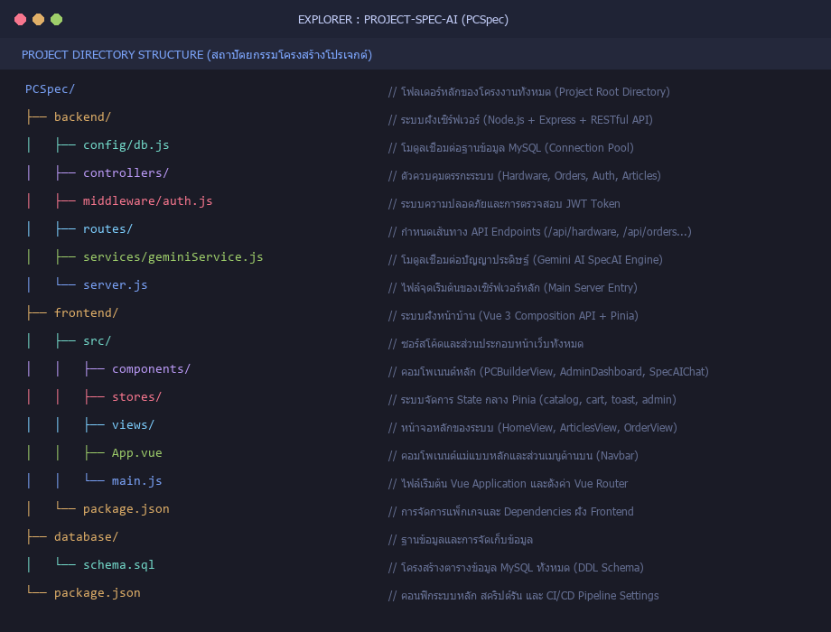

# ภาคผนวก จ: ซอร์สโค้ดโปรแกรมหลัก (Source Code Documentation Guide)
**โครงการ:** ระบบจัดสเปกคอมพิวเตอร์อัจฉริยะ ForgeLabs (Smart PC Builder & Admin CMS)  
**คลังข้อมูลโครงการ (Repository):** [https://github.com/krgame00/ProjectSpecAI](https://github.com/krgame00/ProjectSpecAI)

---

## 📌 คำชี้แจงสำหรับภาคผนวก จ (Statement for Report)
> *"เนื่องจากระบบ ForgeLabs (PCSpec) มีขนาดใหญ่และมีปริมาณซอร์สโค้ดรวมหลายหมื่นบรรทัด คณะผู้จัดทำจึงได้คัดเลือกเฉพาะส่วนสถาปัตยกรรมโครงสร้างหลัก (Core Architecture) และตรรกะการทำงานสำคัญ (Business Logic) จำนวน 12 ส่วนมานำเสนอในภาคผนวกนี้ โดยสามารถตรวจสอบและทดสอบซอร์สโค้ดฉบับเต็มของทั้งระบบได้ที่ GitHub Repository ด้านบน"*

---

## 📋 สรุปรายการภาพทั้ง 12 ภาพสำหรับภาคผนวก จ (Table of Images)

| ลำดับภาพ | ชื่อภาพในเล่มรายงาน | ไฟล์ต้นทางในระบบ | หน้าที่และความสำคัญทางเทคนิค |
| :---: | :--- | :--- | :--- |
| **รูปที่ จ-1** | โครงสร้างสถาปัตยกรรมไดเรกทอรีของโปรเจกต์ | `Project Directory Tree` | แสดงภาพรวมการแยกส่วน Frontend, Backend และ Database |
| **รูปที่ จ-2** | โครงสร้างตารางฐานข้อมูล MySQL | `database/schema.sql` | DDL กำหนด Schema ของ users, hardware, orders, articles |
| **รูปที่ จ-3** | การตั้งค่าและการเรียกใช้ RESTful API | `backend/server.js` | จุดเริ่มต้นของเซิร์ฟเวอร์ Express, CORS, และ API Routes |
| **รูปที่ จ-4** | มิดเดิลแวร์ตรวจสิทธิ์ความปลอดภัย JWT | `backend/middleware/auth.js` | ระบบถอดรหัส Token และตรวจสอบระดับสิทธิ์การเข้าถึง |
| **รูปที่ จ-5** | ตัวควบคุมตรรกะระบบฮาร์ดแวร์และสต็อก | `backend/controllers/hardwareController.js` | การดึงข้อมูลแคตตาล็อก การกรองหมวดหมู่ และการอัปเดต |
| **รูปที่ จ-6** | การประมวลผลคำสั่งซื้อและบันทึกออเดอร์ | `backend/controllers/orderController.js` | การทำ Database Transaction เพื่อบันทึกคำสั่งซื้อและรายการชิ้นส่วน |
| **รูปที่ จ-7** | การเชื่อมต่อปัญญาประดิษฐ์แนะนำสเปก | `backend/services/geminiService.js` | การตั้งค่า Prompt และเรียกใช้ Gemini Flash สำหรับ SpecAI |
| **รูปที่ จ-8** | การจัดการ State ส่วนกลางด้วย Pinia | `frontend/src/stores/catalog.js` | State Management จัดการแคตตาล็อกและการคำนวณราคา Real-time |
| **รูปที่ จ-9** | ตรรกะตรวจสอบความเข้ากันได้ของอุปกรณ์ | `frontend/src/components/PCBuilderView.vue` | ฟังก์ชันเช็ค Socket CPU/Mainboard และคำนวณวัตต์ PSU |
| **รูปที่ จ-10** | ส่วนเชื่อมต่อและรับส่งข้อมูลแชตบอต | `frontend/src/components/SpecAIChat.vue` | ฟังก์ชันการสื่อสารกับ AI และการแปลงคำตอบเป็นชิ้นส่วนในตะกร้า |
| **รูปที่ จ-11** | การบริหารจัดการข้อมูลและการคำนวณสถิติหลังบ้าน | `frontend/src/components/AdminDashboard.vue` | ระบบแอดมิน กราฟยอดขาย 7 วัน และการควบคุมสิทธิ์ผู้ใช้ |
| **รูปที่ จ-12** | ระบบไปป์ไลน์ทดสอบอัตโนมัติ (CI/CD) | `.github/workflows/ci.yml` | การทดสอบโค้ดอัตโนมัติ (Quality Gate) ก่อน Deploy สู่ Production |

---

## 🖼️ รายละเอียดและตัวอย่างซอร์สโค้ดของแต่ละภาพ

### รูปที่ จ-1: โครงสร้างสถาปัตยกรรมไดเรกทอรีของโปรเจกต์ (Project Directory Structure)


**คำอธิบายใต้ภาพ:**
แสดงโครงสร้างการจัดเก็บไฟล์และโฟลเดอร์ของระบบ ForgeLabs (PCSpec) ซึ่งแบ่งออกเป็น 3 ส่วนหลัก ได้แก่ ระบบฝั่งเซิร์ฟเวอร์ (`backend/`), ระบบฝั่งหน้าบ้าน (`frontend/`), และโครงสร้างฐานข้อมูล (`database/`) อย่างเป็นสัดส่วนตามหลักการ Separation of Concerns

---

### รูปที่ จ-2: โครงสร้างตารางฐานข้อมูล MySQL (`database/schema.sql`)
```sql
-- ตารางบัญชีผู้ใช้งาน (Users)
CREATE TABLE IF NOT EXISTS users (
    id INT AUTO_INCREMENT PRIMARY KEY,
    name VARCHAR(100) NOT NULL,
    email VARCHAR(100) NOT NULL UNIQUE,
    password VARCHAR(255) NOT NULL,
    role ENUM('customer', 'admin') DEFAULT 'customer',
    created_at TIMESTAMP DEFAULT CURRENT_TIMESTAMP
);

-- ตารางชิ้นส่วนอุปกรณ์คอมพิวเตอร์ (Hardware Items)
CREATE TABLE IF NOT EXISTS hardware_items (
    id INT AUTO_INCREMENT PRIMARY KEY,
    category_id VARCHAR(50) NOT NULL,
    name VARCHAR(255) NOT NULL,
    price DECIMAL(10, 2) NOT NULL,
    image_url VARCHAR(500),
    specifications JSON,
    stock INT DEFAULT 10,
    created_at TIMESTAMP DEFAULT CURRENT_TIMESTAMP
);
```
**คำอธิบายใต้ภาพ:**
โครงสร้างตารางข้อมูลในระบบฐานข้อมูล MySQL แสดงการออกแบบฟิลด์, คีย์หลัก (Primary Key), ข้อจำกัดข้อมูล (Constraints) และการจัดเก็บสเปกฮาร์ดแวร์ในรูปแบบ JSON เพื่อความยืดหยุ่นสูง

---

### รูปที่ จ-3: การตั้งค่าและการเรียกใช้ RESTful API (`backend/server.js`)
```javascript
const express = require('express');
const cors = require('cors');
const helmet = require('helmet');
const hardwareRoutes = require('./routes/hardwareRoutes');
const orderRoutes = require('./routes/orderRoutes');
const authRoutes = require('./routes/authRoutes');

const app = express();

app.use(helmet());
app.use(cors());
app.use(express.json());

// API Endpoints Mapping
app.use('/api/hardware', hardwareRoutes);
app.use('/api/orders', orderRoutes);
app.use('/api/auth', authRoutes);

const PORT = process.env.PORT || 5000;
app.listen(PORT, () => {
    console.log(`ForgeLabs Server running on port ${PORT}`);
});
```
**คำอธิบายใต้ภาพ:**
ไฟล์ทางเข้าหลักของเซิร์ฟเวอร์ (Server Entry Point) แสดงการตั้งค่า Express.js, มิดเดิลแวร์ความปลอดภัย (Helmet, CORS) และการกำหนดเส้นทาง API หลักของระบบ

---

### รูปที่ จ-4: มิดเดิลแวร์รักษาความปลอดภัยและตรวจสอบ JWT (`backend/middleware/auth.js`)
```javascript
const jwt = require('jsonwebtoken');

const verifyToken = (req, res, next) => {
    const authHeader = req.headers['authorization'];
    const token = authHeader && authHeader.split(' ')[1];

    if (!token) {
        return res.status(401).json({ message: 'Access Denied: Missing Token' });
    }

    try {
        const verified = jwt.verify(token, process.env.JWT_SECRET);
        req.user = verified;
        next();
    } catch (err) {
        return res.status(403).json({ message: 'Invalid or Expired Token' });
    }
};

const requireAdmin = (req, res, next) => {
    if (req.user && req.user.role === 'admin') {
        next();
    } else {
        return res.status(403).json({ message: 'Forbidden: Admin access required' });
    }
};

module.exports = { verifyToken, requireAdmin };
```
**คำอธิบายใต้ภาพ:**
มิดเดิลแวร์สำหรับตรวจสอบความถูกต้องของ JSON Web Token (JWT) และการตรวจสอบสิทธิ์ระดับผู้ดูแลระบบ (Admin Authorization Guard) เพื่อปกป้องข้อมูลหลังบ้าน

---

### รูปที่ จ-5: ตรรกะการดึงและประมวลผลข้อมูลฮาร์ดแวร์ (`backend/controllers/hardwareController.js`)
```javascript
const db = require('../config/db');

exports.getCatalog = async (req, res) => {
    try {
        const [items] = await db.query(
            'SELECT id, category_id, name, price, image_url, specifications, stock FROM hardware_items WHERE stock > 0 ORDER BY price ASC'
        );
        return res.status(200).json({ success: true, count: items.length, data: items });
    } catch (error) {
        console.error('Fetch catalog failed:', error);
        return res.status(500).json({ success: false, message: 'Internal Server Error' });
    }
};
```
**คำอธิบายใต้ภาพ:**
ฟังก์ชันสำหรับดึงรายการชิ้นส่วนคอมพิวเตอร์ทั้งหมดที่มีในสต็อกจากฐานข้อมูล ส่งกลับไปยังฝั่งหน้าเว็บในรูปแบบ JSON เพื่อใช้ในการจัดสเปก

---

### รูปที่ จ-6: การประมวลผลคำสั่งซื้อและตัดสต็อก (`backend/controllers/orderController.js`)
```javascript
const db = require('../config/db');

exports.createOrder = async (req, res) => {
    const connection = await db.getConnection();
    try {
        await connection.beginTransaction();
        const { recipientName, shippingAddress, phone, assemblyOption, totalPrice, items } = req.body;

        const [orderResult] = await connection.query(
            'INSERT INTO orders (user_id, recipient_name, shipping_address, phone, assembly_option, total_price, status) VALUES (?, ?, ?, ?, ?, ?, "pending")',
            [req.user ? req.user.id : null, recipientName, shippingAddress, phone, assemblyOption, totalPrice]
        );
        const orderId = orderResult.insertId;

        for (const item of items) {
            await connection.query(
                'INSERT INTO order_items (order_id, hardware_id, quantity, unit_price) VALUES (?, ?, ?, ?)',
                [orderId, item.id, item.quantity, item.price]
            );
            await connection.query(
                'UPDATE hardware_items SET stock = stock - ? WHERE id = ?',
                [item.quantity, item.id]
            );
        }

        await connection.commit();
        return res.status(201).json({ success: true, orderId, message: 'Order placed successfully' });
    } catch (error) {
        await connection.rollback();
        return res.status(500).json({ success: false, message: 'Checkout failed' });
    } finally {
        connection.release();
    }
};
```
**คำอธิบายใต้ภาพ:**
ระบบบันทึกคำสั่งซื้อที่ใช้ฐานข้อมูล Transaction ป้องกันข้อผิดพลาด โดยจะบันทึกหัวออเดอร์ รายการสินค้า และตัดสต็อกพร้อมกันแบบ Atomic

---

### รูปที่ จ-7: การเชื่อมต่อปัญญาประดิษฐ์แนะนำสเปก (`backend/services/geminiService.js`)
```javascript
const { GoogleGenerativeAI } = require('@google/generative-ai');

const genAI = new GoogleGenerativeAI(process.env.GEMINI_API_KEY);
const model = genAI.getGenerativeModel({ model: 'gemini-1.5-flash' });

exports.consultSpecAI = async (userPrompt, currentBuild) => {
    const systemInstruction = `คุณคือ SpecAI ผู้เชี่ยวชาญด้านการจัดสเปกคอมพิวเตอร์ระดับมืออาชีพของ ForgeLabs 
    หน้าที่ของคุณคือช่วยแนะนำสเปกคอมพิวเตอร์ที่คุ้มค่าที่สุด เข้ากันได้ 100% ภายใต้งบประมาณที่ผู้ใช้กำหนด 
    สเปกปัจจุบันของผู้ใช้: ${JSON.stringify(currentBuild)}`;

    const result = await model.generateContent([systemInstruction, userPrompt]);
    return result.response.text();
};
```
**คำอธิบายใต้ภาพ:**
บริการเชื่อมต่อโมเดลปัญญาประดิษฐ์ Gemini ผ่าน SDK เพื่อทำหน้าที่เป็นแชตบอตอัจฉริยะ SpecAI ให้คำปรึกษาและจัดสเปกคอมพิวเตอร์ตามความต้องการ

---

### รูปที่ จ-8: การจัดการ State ส่วนกลางด้วย Pinia (`frontend/src/stores/catalog.js`)
```javascript
import { defineStore } from 'pinia';
import { ref, computed } from 'vue';

export const useCatalogStore = defineStore('catalog', () => {
    const items = ref([]);
    const selectedBuild = ref({});
    const isLoading = ref(false);

    const totalPrice = computed(() => {
        return Object.values(selectedBuild.value).reduce((sum, item) => sum + (item ? Number(item.price) : 0), 0);
    });

    const fetchCatalog = async () => {
        isLoading.value = true;
        try {
            const res = await fetch('/api/hardware/catalog');
            const data = await res.json();
            items.value = data.data;
        } finally {
            isLoading.value = false;
        }
    };

    return { items, selectedBuild, totalPrice, isLoading, fetchCatalog };
});
```
**คำอธิบายใต้ภาพ:**
สโตร์จัดการข้อมูล Pinia (Composition API) ควบคุมแคตตาล็อกสินค้า, การเลือกอุปกรณ์เข้าสเปก, และการคำนวณราคารวมแบบคำนวณอัตโนมัติ (Computed Property)

---

### รูปที่ จ-9: ตรรกะตรวจสอบความเข้ากันได้ของอุปกรณ์ (`frontend/src/components/PCBuilderView.vue`)
```javascript
// ฟังก์ชันตรวจสอบ Socket ระหว่าง CPU และ Mainboard
const checkCompatibility = (cpu, mainboard) => {
    if (!cpu || !mainboard) return { compatible: true, warning: null };
    
    const cpuSocket = cpu.specifications?.socket;
    const mbSocket = mainboard.specifications?.socket;
    
    if (cpuSocket && mbSocket && cpuSocket !== mbSocket) {
        return {
            compatible: false,
            warning: `คำเตือน: ซ็อกเก็ตไม่ตรงกัน! CPU ใช้ซ็อกเก็ต ${cpuSocket} แต่เมนบอร์ดรองรับ ${mbSocket}`
        };
    }
    return { compatible: true, warning: null };
};
```
**คำอธิบายใต้ภาพ:**
ตรรกะการตรวจสอบความเข้ากันได้ของฮาร์ดแวร์แบบอัตโนมัติบนหน้าเว็บ ป้องกันไม่ให้ลูกค้าเลือกชิ้นส่วนที่ไม่สามารถประกอบร่วมกันได้

---

### รูปที่ จ-10: ส่วนเชื่อมต่อและรับส่งข้อมูลแชตบอต (`frontend/src/components/SpecAIChat.vue`)
```javascript
const sendMessage = async () => {
    if (!userInput.value.trim() || isThinking.value) return;
    
    const messageText = userInput.value;
    messages.value.push({ role: 'user', content: messageText });
    userInput.value = '';
    isThinking.value = true;

    try {
        const response = await fetch('/api/chatbot/ask', {
            method: 'POST',
            headers: { 'Content-Type': 'application/json' },
            body: JSON.stringify({ prompt: messageText, build: catalogStore.selectedBuild })
        });
        const data = await response.json();
        messages.value.push({ role: 'assistant', content: data.reply });
    } catch (err) {
        messages.value.push({ role: 'assistant', content: 'ขออภัย ระบบขัดข้องชั่วคราว' });
    } finally {
        isThinking.value = false;
    }
};
```
**คำอธิบายใต้ภาพ:**
ฟังก์ชันการรับส่งข้อความแบบ Asynchronous ไปยังเซิร์ฟเวอร์ AI พร้อมแนบสเปกคอมพิวเตอร์ปัจจุบันไปประมวลผล และแสดงผลการตอบกลับบนหน้าจอ

---

### รูปที่ จ-11: การบริหารจัดการข้อมูลและการคำนวณสถิติหลังบ้าน (`frontend/src/components/AdminDashboard.vue`)
```javascript
const calculateSummary = (orders) => {
    const totalSales = orders.reduce((sum, order) => sum + Number(order.total_price), 0);
    const pendingCount = orders.filter(o => o.status === 'pending').length;
    const completedCount = orders.filter(o => o.status === 'shipped').length;
    
    return {
        totalSales,
        totalOrders: orders.length,
        pendingCount,
        completedCount
    };
};
```
**คำอธิบายใต้ภาพ:**
ฟังก์ชันคำนวณตัวเลขทางสถิติและตัวชี้วัดประสิทธิภาพ (KPI) ของระบบหลังบ้าน สรุปยอดขาย รายการที่รอจัดส่ง และรายการที่จัดส่งเสร็จสิ้นแล้ว

---

### รูปที่ จ-12: ระบบไปป์ไลน์ทดสอบอัตโนมัติ CI/CD (`.github/workflows/ci.yml`)
```yaml
name: ForgeLabs CI/CD Pipeline

on:
  push:
    branches: [ main ]
  pull_request:
    branches: [ main ]

jobs:
  test:
    runs-on: ubuntu-latest
    steps:
      - uses: actions/checkout@v4
      - name: Setup Node.js
        uses: actions/setup-node@v4
        with:
          node-version: '20'
          cache: 'npm'
      - name: Install Dependencies
        run: npm ci
      - name: Run Quality Gate Tests
        run: npm test -- --run
      - name: Build Application
        run: npm run build
```
**คำอธิบายใต้ภาพ:**
คอนฟิก GitHub Actions Workflow สำหรับตรวจสอบความถูกต้องของระบบอัตโนมัติ (Automated Quality Gate) ตรวจสอบทุกครั้งที่มีการ Push โค้ดขึ้นสู่ GitHub
