# คู่มือการใช้งานระบบ ForgeLabs (PCSpec User Manual)
คู่มือการใช้งานระบบจัดสเปกคอมพิวเตอร์อัจฉริยะ (Smart PC Builder) และระบบบริหารจัดการหลังบ้าน (Admin Panel)

---

## สารบัญคู่มือ (Table of Contents)
1. [หน้าแรก (Landing Page)](#1-หน้าแรก-landing-page)
2. [หน้าต่างเข้าสู่ระบบ (Login Modal)](#2-หน้าต่างเข้าสู่ระบบ-login-modal)
3. [หน้าต่างสมัครสมาชิก (Register Modal)](#3-หน้าต่างสมัครสมาชิก-register-modal)
4. [หน้าระบบจัดสเปกคอมพิวเตอร์ (Smart PC Builder)](#4-หน้าระบบจัดสเปกคอมพิวเตอร์-smart-pc-builder)
5. [การ์ดชิ้นส่วนฮาร์ดแวร์ (Product Card Anatomy)](#5-การ์ดชิ้นส่วนฮาร์ดแวร์-product-card-anatomy)
6. [ผู้ช่วยจัดสเปกอัจฉริยะ SpecAI (AI Assistant Chatbot)](#6-ผู้ช่วยจัดสเปกอัจฉริยะ-specai-ai-assistant-chatbot)
7. [หน้าคลังบทความและความรู้ (Articles Hub)](#7-หน้าคลังบทความและความรู้-articles-hub)
8. [หน้าสรุปรายการสั่งซื้อและชำระเงิน (Checkout / Order Summary)](#8-หน้าสรุปรายการสั่งซื้อและชำระเงิน-checkout--order-summary)
9. [ระบบหลังบ้านแอดมิน: Dashboard ภาพรวม](#9-ระบบหลังบ้านแอดมิน-dashboard-ภาพรวม)
10. [ระบบหลังบ้านแอดมิน: จัดการคำสั่งซื้อ (Orders Management)](#10-ระบบหลังบ้านแอดมิน-จัดการคำสั่งซื้อ-orders-management)
11. [ระบบหลังบ้านแอดมิน: จัดการสินค้าคงคลัง (Inventory Management)](#11-ระบบหลังบ้านแอดมิน-จัดการสินค้าคงคลัง-inventory-management)
12. [ระบบหลังบ้านแอดมิน: จัดการสมาชิก (Users Management)](#12-ระบบหลังบ้านแอดมิน-จัดการสมาชิก-users-management)

---

### 1. หน้าแรก (Landing Page)

- **หมายเลขที่ 1** ปุ่ม "จัดสเปค" (เมนูด้านบน) กดเพื่อเข้าสู่หน้าระบบจัดสเปกคอมพิวเตอร์ (Smart PC Builder)
- **หมายเลขที่ 2** ปุ่ม "บทความ" (เมนูด้านบน) กดเพื่อเข้าสู่หน้าคลังบทความและความรู้ฮาร์ดแวร์
- **หมายเลขที่ 3** ปุ่ม "เข้าสู่ระบบ" (เมนูด้านบน) กดเพื่อเปิดหน้าต่างเข้าสู่ระบบหรือสมัครสมาชิก
- **หมายเลขที่ 4** ปุ่ม "เริ่มจัดสเปคเลย ->" (ปุ่มหลักกลางจอ) กดเพื่อเริ่มต้นเลือกอุปกรณ์และจัดสเปกคอมพิวเตอร์ทันที
- **หมายเลขที่ 5** ปุ่ม "ดูฟีเจอร์ทั้งหมด" (ปุ่มรองกลางจอ) กดเพื่อเลื่อนลงดูฟังก์ชันเด่นทั้งหมดของเว็บไซต์

---

### 2. หน้าต่างเข้าสู่ระบบ (Login Modal)
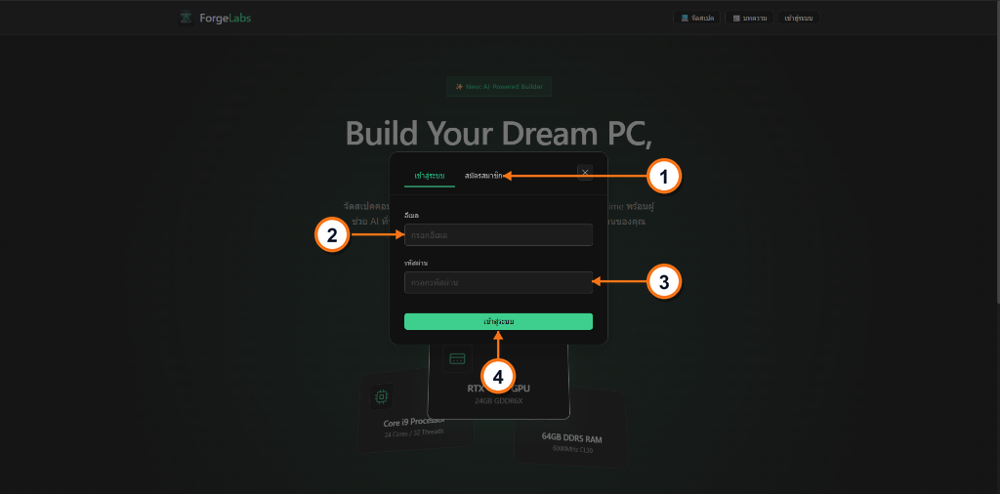

- **หมายเลขที่ 1** ปุ่มแถบ "สมัครสมาชิก" กดเพื่อเข้าหน้าสมัครสมาชิกสำหรับผู้ใช้ใหม่
- **หมายเลขที่ 2** ช่อง "อีเมล" กดเพื่อพิมพ์กรอกที่อยู่อีเมลของบัญชีผู้ใช้
- **หมายเลขที่ 3** ช่อง "รหัสผ่าน" กดเพื่อพิมพ์กรอกรหัสผ่านสำหรับเข้าสู่ระบบ
- **หมายเลขที่ 4** ปุ่ม "เข้าสู่ระบบ" กดเพื่อยืนยันเข้าสู่ระบบบัญชีผู้ใช้

---

### 3. หน้าต่างสมัครสมาชิก (Register Modal)
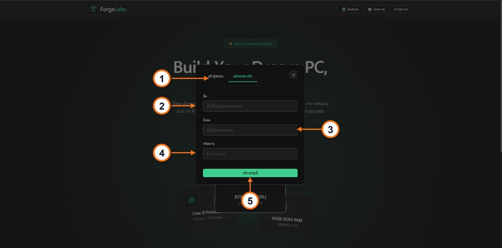

- **หมายเลขที่ 1** ปุ่มแถบ "เข้าสู่ระบบ" กดเพื่อเข้าหน้าเข้าสู่ระบบสำหรับผู้ที่มีบัญชีอยู่แล้ว
- **หมายเลขที่ 2** ช่อง "ชื่อ" กดเพื่อพิมพ์กรอกชื่อที่ต้องการให้แสดงในระบบ
- **หมายเลขที่ 3** ช่อง "อีเมล" กดเพื่อพิมพ์กรอกอีเมลสำหรับใช้สมัครสมาชิก
- **หมายเลขที่ 4** ช่อง "รหัสผ่าน" กดเพื่อพิมพ์กรอกรหัสผ่านความปลอดภัย
- **หมายเลขที่ 5** ปุ่ม "สร้างบัญชี" กดเพื่อยืนยันการลงทะเบียนสร้างบัญชีผู้ใช้ใหม่

---

### 4. หน้าระบบจัดสเปกคอมพิวเตอร์ (Smart PC Builder)
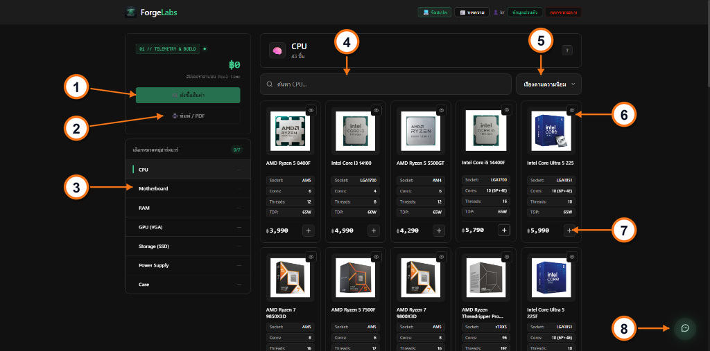

- **หมายเลขที่ 1** ปุ่ม "สั่งซื้อสินค้า" (สีเขียว) กดเพื่อนำรายการชิ้นส่วนทั้งหมดเข้าสู่หน้าสรุปการสั่งซื้อและชำระเงิน
- **หมายเลขที่ 2** ปุ่ม "พิมพ์ PDF" กดเพื่อออกเอกสารใบเสนอราคาสเปกคอมพิวเตอร์ในรูปแบบไฟล์ PDF
- **หมายเลขที่ 3** แถบปุ่ม "หมวดหมู่อุปกรณ์" กดเพื่อเลือกสลับประเภทชิ้นส่วนคอมพิวเตอร์ (CPU, Mainboard, RAM ฯลฯ)
- **หมายเลขที่ 4** ช่อง "ค้นหาอุปกรณ์" กดเพื่อพิมพ์ค้นหาชื่อรุ่นหรือรหัสสินค้าที่ต้องการแบบ Real-time
- **หมายเลขที่ 5** ปุ่มดรอปดาวน์ "เรียงตามราคา" กดเพื่อเรียงลำดับสินค้าจากราคาต่ำไปสูง หรือราคาสูงไปต่ำ
- **หมายเลขที่ 6** ปุ่ม "ดูข้อมูลเพิ่มเติม" (ไอคอนตา) กดเพื่อเปิดหน้าต่างดูสเปกเชิงลึกและภาพ 3 มิติของอุปกรณ์
- **หมายเลขที่ 7** ปุ่ม "เพิ่มลงสเปก (+)" กดเพื่อเลือกชิ้นส่วนนั้นๆ ใส่เข้าในชุดจัดสเปกคอมพิวเตอร์
- **หมายเลขที่ 8** ปุ่มแชตบอต "SpecAI" (ปุ่มลอยมุมขวาล่าง) กดเพื่อเปิดหน้าต่างผู้ช่วย AI แนะนำสเปกคอมพิวเตอร์

---

### 5. การ์ดชิ้นส่วนฮาร์ดแวร์ (Product Card Anatomy)
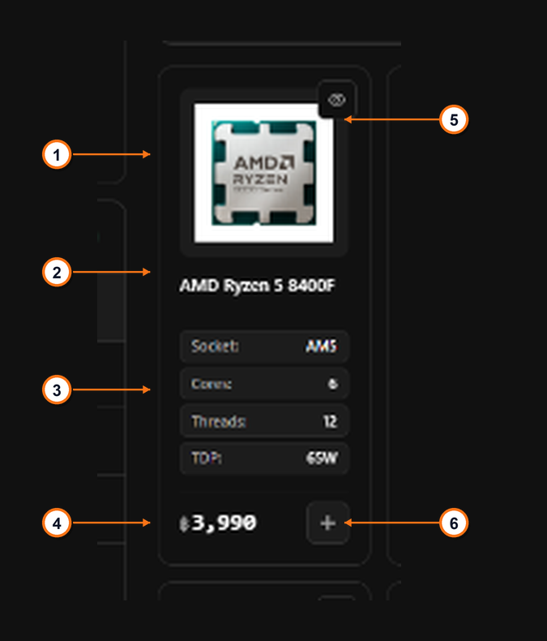

- **หมายเลขที่ 1** รูปภาพชิ้นส่วน แสดงภาพถ่ายตัวอย่างของอุปกรณ์ฮาร์ดแวร์
- **หมายเลขที่ 2** ชื่อรุ่นชิ้นส่วน แสดงชื่อรุ่น แบรนด์ และซีรีส์ของอุปกรณ์
- **หมายเลขที่ 3** สเปกสำคัญ แสดงข้อมูลทางเทคนิคหลัก (เช่น Socket, Cores, Threads, TDP)
- **หมายเลขที่ 4** ราคาจำหน่าย แสดงราคาสินค้าอัปเดตล่าสุด
- **หมายเลขที่ 5** ปุ่ม "ดูข้อมูลเพิ่มเติม" (ไอคอนตา) กดเพื่อเปิดหน้าต่างดูสเปกเชิงลึกและภาพ 3 มิติ
- **หมายเลขที่ 6** ปุ่ม "เพิ่มลงสเปก (+)" กดเพื่อเลือกชิ้นส่วนนี้เข้าสู่ชุดจัดสเปกคอมพิวเตอร์

---

### 6. ผู้ช่วยจัดสเปกอัจฉริยะ SpecAI (AI Assistant Chatbot)
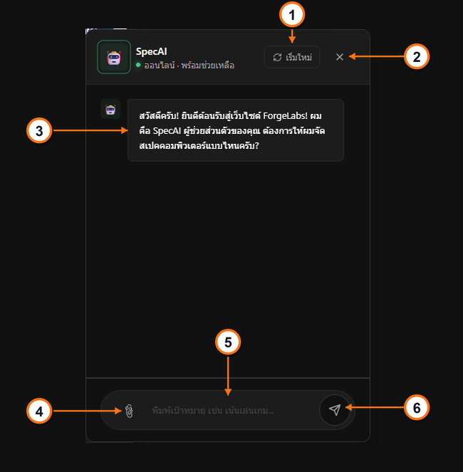

- **หมายเลขที่ 1** ปุ่ม "รีเซ็ต" (ไอคอนรีเฟรช) กดเพื่อล้างประวัติการพูดคุยและเริ่มบทสนทนาใหม่กับ AI
- **หมายเลขที่ 2** ปุ่ม "ปิดหน้าต่าง (✕)" กดเพื่อย่อเก็บหน้าต่างแชตบอตกลับไปเป็นปุ่มลอย
- **หมายเลขที่ 3** กล่องข้อความตอบกลับ AI แสดงคำแนะนำสเปกและเหตุผลในการจัดอุปกรณ์จาก AI
- **หมายเลขที่ 4** ปุ่มคลิปหนีบกระดาษ (📎) กดเพื่อแนบรายการสเปกปัจจุบันส่งให้ AI ช่วยวิเคราะห์
- **หมายเลขที่ 5** ช่อง "พิมพ์ข้อความ" กดเพื่อพิมพ์คำถาม ความต้องการใช้งาน หรือบอกงบประมาณที่ต้องการ
- **หมายเลขที่ 6** ปุ่ม "ส่งข้อความ (➤)" กดเพื่อส่งคำถามไปยัง AI ให้ประมวลผลคำตอบ

---

### 7. หน้าคลังบทความและความรู้ (Articles Hub)
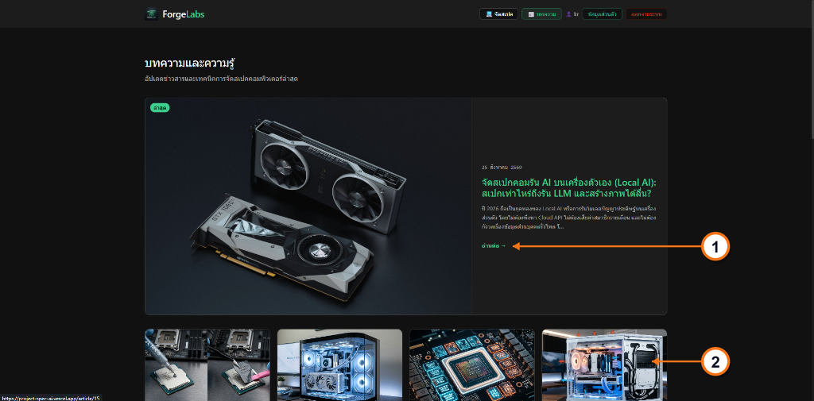

- **หมายเลขที่ 1** ปุ่ม "อ่านต่อ →" กดเพื่อเข้าอ่านเนื้อหาฉบับเต็มของบทความเด่นประจำสัปดาห์
- **หมายเลขที่ 2** การ์ดบทความทั่วไป กดเพื่อเปิดอ่านบทความย่อยเรื่องอื่นๆ ในระบบ

---

### 8. หน้าสรุปรายการสั่งซื้อและชำระเงิน (Checkout / Order Summary)
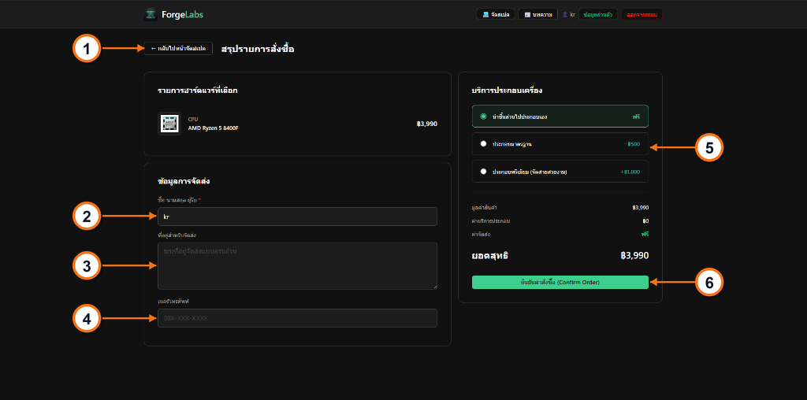

- **หมายเลขที่ 1** ปุ่ม "← กลับไปหน้าจัดสเปค" กดเพื่อย้อนกลับไปหน้าจัดสเปกสำหรับแก้ไขหรือเลือกชิ้นส่วนเพิ่ม
- **หมายเลขที่ 2** ช่อง "ชื่อ นามสกุล ผู้รับ" กดเพื่อพิมพ์กรอกชื่อและนามสกุลจริงของผู้รับพัสดุ
- **หมายเลขที่ 3** ช่อง "ที่อยู่สำหรับจัดส่ง" กดเพื่อพิมพ์กรอกข้อมูลที่อยู่จัดส่งแบบละเอียดครบถ้วน
- **หมายเลขที่ 4** ช่อง "เบอร์โทรศัพท์" กดเพื่อพิมพ์กรอกเบอร์โทรศัพท์มือถือสำหรับให้พนักงานขนส่งติดต่อ
- **หมายเลขที่ 5** ตัวเลือก "บริการประกอบเครื่อง" กดเพื่อเลือกว่าจะนำไปประกอบเอง (ฟรี) หรือให้ช่างประกอบ (+฿500 / +฿1,000)
- **หมายเลขที่ 6** ปุ่ม "ยืนยันคำสั่งซื้อ (Confirm Order)" กดเพื่อส่งข้อมูล บันทึกคำสั่งซื้อลงระบบ และสร้าง Order ID

---

### 9. ระบบหลังบ้านแอดมิน: Dashboard ภาพรวม
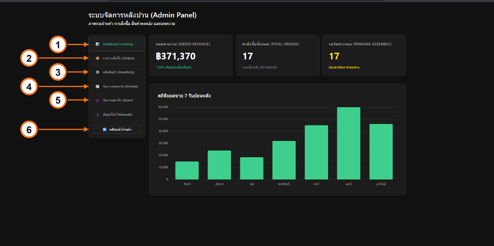

- **หมายเลขที่ 1** แถบ "Dashboard ภาพรวม" กดเพื่อดูตัวเลขสถิติยอดขายรวม คำสั่งซื้อ และกราฟสถิติ 7 วันย้อนหลัง
- **หมายเลขที่ 2** แถบ "รายการสั่งซื้อ (Orders)" กดเพื่อเข้าสู่หน้ารายการสั่งซื้อของลูกค้า
- **หมายเลขที่ 3** แถบ "คลังสินค้า (Inventory)" กดเพื่อเข้าสู่ระบบบริหารจัดการสต็อกชิ้นส่วนคอมพิวเตอร์
- **หมายเลขที่ 4** แถบ "จัดการบทความ (Articles)" กดเพื่อเข้าสู่ระบบ CMS สำหรับเขียนและจัดการบทความ
- **หมายเลขที่ 5** แถบ "จัดการสมาชิก (Users)" กดเพื่อเข้าสู่หน้าบริหารจัดการรายชื่อและสิทธิ์ของผู้ใช้งาน
- **หมายเลขที่ 6** ปุ่ม "กลับหน้าร้านค้า" กดเพื่อสลับออกจากระบบแอดมินและกลับไปยังหน้าร้านค้าหลัก

---

### 10. ระบบหลังบ้านแอดมิน: จัดการคำสั่งซื้อ (Orders Management)
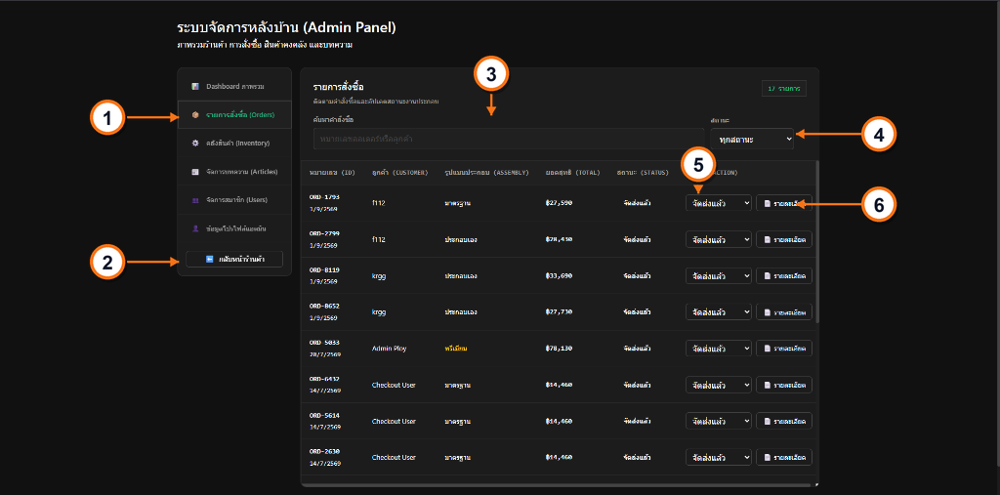

- **หมายเลขที่ 1** แถบ "รายการสั่งซื้อ (Orders)" กดเพื่อเปิดโมดูลบริหารคำสั่งซื้อ
- **หมายเลขที่ 2** ปุ่ม "กลับหน้าร้านค้า" กดเพื่อสลับออกจากระบบแอดมินกลับสู่หน้าร้านค้าหลัก
- **หมายเลขที่ 3** ช่อง "ค้นหาคำสั่งซื้อ" กดเพื่อพิมพ์ค้นหาด้วยหมายเลขออเดอร์หรือชื่อลูกค้า
- **หมายเลขที่ 4** ดรอปดาวน์ "สถานะ" กดเพื่อเลือกกรองดูออเดอร์ตามสถานะ (ทุกสถานะ, รอจัดประกอบ, จัดส่งแล้ว)
- **หมายเลขที่ 5** ดรอปดาวน์ "เปลี่ยนสถานะ" (ในแถวตาราง) กดเพื่อปรับเปลี่ยนสถานะของคำสั่งซื้อนั้นๆ แบบ Real-time
- **หมายเลขที่ 6** ปุ่ม "📋 รายละเอียด" กดเพื่อเปิดหน้าต่างดูรายการสเปกคอมพิวเตอร์และข้อมูลจัดส่งของออเดอร์นั้นๆ

---

### 11. ระบบหลังบ้านแอดมิน: จัดการสินค้าคงคลัง (Inventory Management)
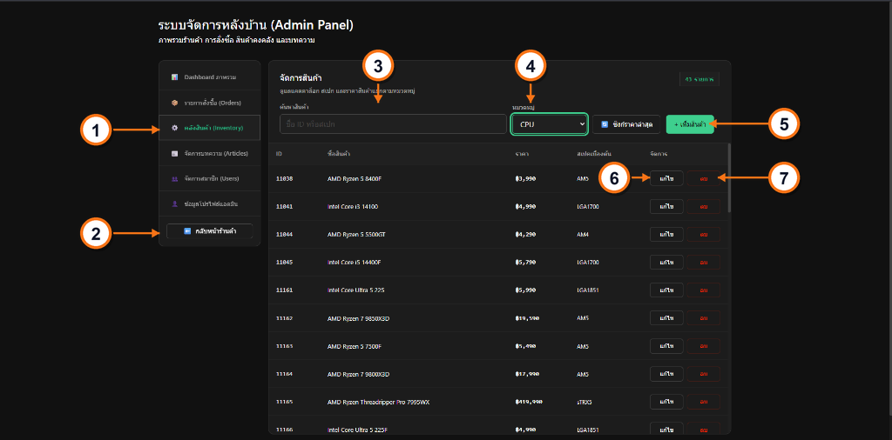

- **หมายเลขที่ 1** แถบ "คลังสินค้า (Inventory)" กดเพื่อเปิดโมดูลบริหารสต็อกฮาร์ดแวร์
- **หมายเลขที่ 2** ปุ่ม "กลับหน้าร้านค้า" กดเพื่อสลับออกจากระบบแอดมินกลับสู่หน้าร้านค้าหลัก
- **หมายเลขที่ 3** ช่อง "ค้นหาสินค้า" กดเพื่อพิมพ์ค้นหาด้วยชื่อสินค้า, รหัส ID หรือสเปกฮาร์ดแวร์
- **หมายเลขที่ 4** ดรอปดาวน์ "หมวดหมู่" กดเพื่อเลือกกรองแสดงเฉพาะประเภทฮาร์ดแวร์ (CPU, VGA, RAM ฯลฯ)
- **หมายเลขที่ 5** ปุ่ม "+ เพิ่มสินค้า" (สีเขียว) กดเพื่อเปิด Modal สำหรับกรอกข้อมูลและเพิ่มชิ้นส่วนใหม่เข้าระบบ
- **หมายเลขที่ 6** ปุ่ม "แก้ไข" (ในแถวสินค้า) กดเพื่อเปิด Modal แก้ไขข้อมูลสินค้า (ชื่อ, ราคา, สเปก, รูปภาพ)
- **หมายเลขที่ 7** ปุ่ม "ลบ" (สีแดง) กดเพื่อลบชิ้นส่วนฮาร์ดแวร์นั้นออกจากระบบฐานข้อมูล

---

### 12. ระบบหลังบ้านแอดมิน: จัดการสมาชิก (Users Management)
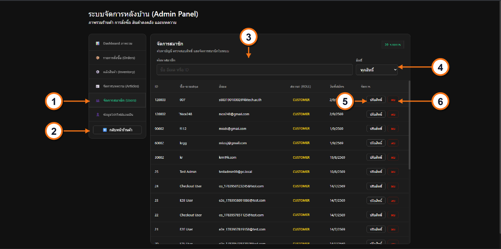

- **หมายเลขที่ 1** แถบ "จัดการสมาชิก (Users)" กดเพื่อเปิดโมดูลบริหารจัดการผู้ใช้งาน
- **หมายเลขที่ 2** ปุ่ม "กลับหน้าร้านค้า" กดเพื่อสลับออกจากระบบแอดมินกลับสู่หน้าร้านค้าหลัก
- **หมายเลขที่ 3** ช่อง "ค้นหาสมาชิก" กดเพื่อพิมพ์ค้นหาด้วยชื่อ-นามสกุล, อีเมล หรือรหัส ID ผู้ใช้
- **หมายเลขที่ 4** ดรอปดาวน์ "สิทธิ์" กดเพื่อเลือกกรองดูผู้ใช้ตามระดับสิทธิ์ (ทุกสิทธิ์, Admin, Customer)
- **หมายเลขที่ 5** ปุ่ม "ปรับสิทธิ์" (ในแถวสมาชิก) กดเพื่อสลับระดับสิทธิ์ของผู้ใช้งานระหว่าง Customer และ Admin
- **หมายเลขที่ 6** ปุ่ม "ลบ" (สีแดง) กดเพื่อลบบัญชีสมาชิกนั้นออกจากระบบฐานข้อมูล

---

## ภาคผนวก จ: ซอร์สโค้ดโปรแกรมหลัก (Source Code Guide)
สามารถดูรายละเอียดโครงสร้างภาพและตัวอย่างซอร์สโค้ดทั้ง 12 ภาพสำหรับภาคผนวก จ ได้ที่ [APPENDIX_GUIDE.md](APPENDIX_GUIDE.md)
