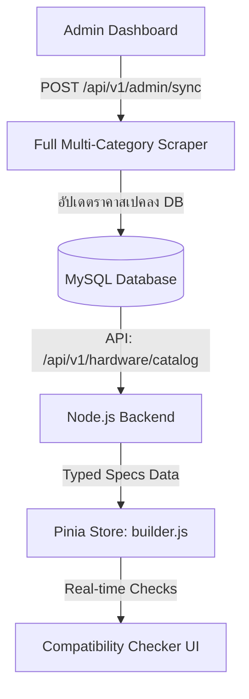

# 🎯 แผนงานปฏิบัติการขั้นถัดไป: ระบบตรวจสอบความเข้ากันได้ & Admin Sync (PCSpec Next Phases Master Plan)

> **สำหรับ AI Agents (Claude, ChatGPT, DeepSeek, Cursor) & Developers:**  
> เอกสารนี้เป็นแผนงานละเอียดระดับโปรดักชัน (Step-by-Step Action Plan) สำหรับใช้รันหรือสั่งการต่อได้ทันที แต่ละฟีเจอร์มีข้อกำหนด โค้ดตัวอย่าง ไฟล์ที่ต้องแก้ไข และคำสั่งทดสอบครบถ้วน

---

## 📋 ภาพรวมฟีเจอร์หลัก 3 ด้านที่จะทำถัดไป (Upcoming Features Overview)



---

## 🛠️ Phase 1: สคริปต์สแครปสินค้าครบทุกหมวดหมู่อัตโนมัติ (Full Multi-Category Auto-Scraper)

**เป้าหมาย:** ปรับปรุง `scripts/fast_scrape_ihavecpu_correct.py` ให้รองรับการดึงสินค้าครบ 7 หมวดหมู่ (CPU, Mainboard, GPU, RAM, Storage, PSU, Case) ด้วยคำสั่งเดียว

### 📁 ไฟล์ที่ต้องแก้ไข:
- `scripts/fast_scrape_ihavecpu_correct.py`

### 📝 ขั้นตอนการทำงานสำหรับ AI (Step-by-Step):
1. **เพิ่มพารามิเตอร์ Category IDs:**
   - `CPU`: `category_id = 1`
   - `Mainboard`: `category_id = 2`
   - `GPU`: `category_id = 3`
   - `RAM`: `category_id = 4`
   - `Storage`: `category_id = 15`
   - `PSU`: `category_id = 6`
   - `Case`: `category_id = 7`
2. **เพิ่มพารามิเตอร์ CLI Argument `--category`:**
   ```bash
   python scripts/fast_scrape_ihavecpu_correct.py --category all --limit 20
   ```
3. **รันคำสั่งซิงค์ข้อมูลเข้า DB:**
   ```bash
   python scripts/fast_scrape_ihavecpu_correct.py --category all --limit 20
   node node-backend/scripts/populate_typed_specs.js
   node node-backend/scripts/export_db_to_html.js
   ```

---

## ⚙️ Phase 2: ระบบตรวจสอบความเข้ากันได้ของอุปกรณ์ (Dynamic Compatibility Checker Engine)

**เป้าหมาย:** นำข้อมูลสเปคเชิงลึกจากตารางย่อย `spec_*` มาใช้คำนวณและแสดงผลการแจ้งเตือนอุปกรณ์ไม่เข้ากันบนหน้าเว็บแบบ Real-time

### 📁 ไฟล์ที่ต้องแก้ไข:
- **Backend:** `node-backend/controllers/hardwareController.js` (ปรับ API ให้ JOIN ตาราง `spec_*` และส่งค่า Typed Specs)
- **Frontend Store:** `Frontend/src/stores/builder.js` (เพิ่ม Pinia Getters ตรวจสอบ 5 กฎ)
- **Frontend UI:** `Frontend/src/components/BuildSummary.vue` หรือ `HardwareSelection.vue` (แสดงแถบเตือนสีแดง/เขียว)

### 📝 กฎการตรวจสอบ 5 จุด (5 Core Compatibility Rules):

#### 1. CPU & Motherboard Socket Matching
- **เงื่อนไข:** `cpu.socket` ต้องตรงกับ `motherboard.socket`
- **ตัวอย่างข้อความเตือน:** ⚠️ *"CPU Socket (AM5) ไม่รองรับกับ Motherboard Socket (AM4)"*

#### 2. Motherboard & RAM Memory Type Matching
- **เงื่อนไข:** `motherboard.ramType` (`DDR4` หรือ `DDR5`) ต้องตรงกับ `ram.type`
- **ตัวอย่างข้อความเตือน:** ⚠️ *"Motherboard รองรับเฉพาะแรม DDR5 แต่คุณเลือกแรม DDR4"*

#### 3. Motherboard & Case Form Factor Clearance
- **เงื่อนไข:** `case.formFactorSupport` ต้องครอบคลุมขนาด `motherboard.formFactor` (เช่น Case ATX รองรับ ATX, Micro-ATX, Mini-ITX)
- **ตัวอย่างข้อความเตือน:** ⚠️ *"เมนบอร์ดขนาด ATX ใหญ่เกินกว่าจะใส่ในเคสขนาด Mini-ITX"*

#### 4. Estimated Power Consumption vs PSU Wattage
- **เงื่อนไข:** `(cpu.tdp + gpu.tdp + 150W Safety Margin)` ต้องไม่เกิน `psu.wattage`
- **ตัวอย่างข้อความเตือน:** ⚠️ *"กำลังไฟรวมโดยประมาณ (650W) สูงกว่า PSU ที่เลือก (550W) แนะนำ PSU 750W ขึ้นไป"*

#### 5. GPU Length vs Case Max GPU Clearance
- **เงื่อนไข:** `gpu.lengthMm` ต้องไม่เกิน `case.maxGpuLength`
- **ตัวอย่างข้อความเตือน:** ⚠️ *"การ์ดจอมีความยาว 340mm ซึ่งเกินระยะรองรับของเคส (300mm)"*

### 🧪 โค้ดตัวอย่างใน Pinia Store (`Frontend/src/stores/builder.js`):
```javascript
compatibilityIssues(state) {
  const issues = [];
  const { cpu, mobo, ram, gpu, psu, case: pcCase } = state.selectedComponents;

  // 1. Socket Check
  if (cpu && mobo && cpu.socket && mobo.socket && cpu.socket.toLowerCase() !== mobo.socket.toLowerCase()) {
    issues.push(`CPU Socket (${cpu.socket}) ไม่เข้ากับ Motherboard Socket (${mobo.socket})`);
  }

  // 2. RAM Type Check
  if (mobo && ram && mobo.ramType && ram.type && mobo.ramType.toLowerCase() !== ram.type.toLowerCase()) {
    issues.push(`Motherboard รองรับเฉพาะแรม ${mobo.ramType} แต่เลือกแรม ${ram.type}`);
  }

  // 3. Power Supply Check
  if (psu && psu.wattage) {
    const totalTdp = (cpu?.tdp || 65) + (gpu?.tdp || 150) + 150;
    if (totalTdp > psu.wattage) {
      issues.push(`กำลังไฟรวมโดยประมาณ (${totalTdp}W) เกินกำลังของ PSU (${psu.wattage}W)`);
    }
  }

  return issues;
}
```

---

## 🔒 Phase 3: ระบบกดซิงค์ราคาสดจาก Admin UI (One-Click Admin Sync)

**เป้าหมาย:** เพิ่มปุ่มกดซิงค์ราคาสินค้าบนหน้า Admin Dashboard เพื่อให้ผู้ดูแลระบบกดอัปเดตราคาสดได้ทุกเมื่อ

### 📁 ไฟล์ที่ต้องแก้ไข:
- **Backend Route:** `node-backend/routes/hardware.js` และ `node-backend/controllers/hardwareController.js`
- **Admin Frontend:** `Frontend/src/views/AdminView.vue`

### 📝 ขั้นตอนการทำงานสำหรับ AI (Step-by-Step):
1. **สร้าง API Endpoint ใน Node.js Backend:**
   - `POST /api/v1/hardware/admin/sync`
   - รันคำสั่ง `exec('python scripts/fast_scrape_ihavecpu_correct.py --limit 10 && node node-backend/scripts/populate_typed_specs.js')` เบื้องหลัง
2. **สร้างปุ่มใน Admin Dashboard (`AdminView.vue`):**
   - ปุ่ม **"🔄 ซิงค์ราคาและสเปคล่าสุด (Sync Prices)"**
   - แสดงสถานะ Loading Spinner + Notification Toast เมื่อซิงค์สำเร็จ

---

## 📊 สรุปตารางเช็คลิสต์และคำสั่งทดสอบ (Testing Checklist)

| ฟีเจอร์ | คำสั่งทดสอบ (Command) | ผลลัพธ์ที่คาดหวัง |
| :--- | :--- | :--- |
| **Full Scraper** | `python scripts/fast_scrape_ihavecpu_correct.py --category all` | ดึงข้อมูลฮาร์ดแวร์ครบ 7 หมวดหมู่ บันทึกลง MySQL |
| **Typed Specs DB** | `node node-backend/scripts/populate_typed_specs.js` | อัปเดตตาราง `spec_*` ครบถ้วน |
| **Unit Test Builder** | `cd Frontend && npm test` | Vitest Unit Tests สำหรับ Compatibility Rules ผ่านทั้งหมด |
| **E2E Web Check** | เปิด `http://localhost:5173/build` | ลองเลือก CPU AM5 + Mobo AM4 จะมีข้อความเตือนสีแดงโผล่ขึ้นมาทันที |

---
*เอกสารนี้จัดทำขึ้นเพื่อใช้เป็นพิมพ์เขียว (Master Implementation Guide) สำหรับ AI Agent และ Developer ในการพัฒนาฟีเจอร์ถัดไปของโครงการ PCSpec*
